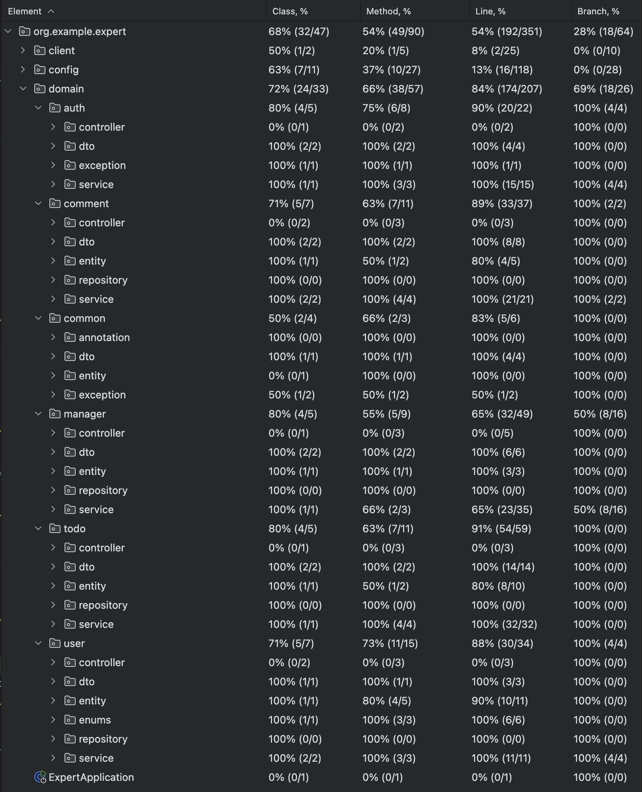

# SPRING ADVANCED

# Lv. 5 
## 1. [문제 인식 및 정의]

ManagerService.getManagers() 메서드에서 Todo 엔티티의 존재 여부만 확인하는데, findById(todoId)로 전체 엔티티를 조회하고 있었다.

이는 아래와 같은 불필요한 동작이 발생된다.

- 전체 Row 데이터를 가져오는 쿼리 발생
- JPA가 엔티티로 매핑하는 비용 발생

## 2. [해결 방안]

### 2-1. [의사결정 과정]

- 기존 로직은 단지 Todo가 존재하는지만 확인하고 있음
- 따라서 실제 엔티티 조회가 아니라, 존재 여부만 판단하면 충분
- Spring Data JPA의 existsById()는 쿼리 비용이 낮고, boolean만 반환하므로 더 효율적

### 2-2. [해결 과정]

```java
Todo todo = todoRepository.findById(todoId)
        .orElseThrow(() -> new InvalidRequestException("Todo not found"));
```

```java
if (!todoRepository.existsById(todoId)) {
    throw new InvalidRequestException("Todo not found");
}
```

- DB에서 전체 row를 가져오는 것이 아니라, 인덱스를 활용하여 가볍게 **존재 확인 쿼리**로 변경됨
- JPA의 **엔티티 변환 과정도 생략**되어, 전체적인 처리 비용 감소됨

## 3. [해결 완료]

### 3-1. [회고]

- 대량 호출되거나, 반복적으로 쓰이는 API 에서는 반드시 고려되어야 할 부분임
- 이런 작은 차이가 대규모 서비스 에서는 영향을 줄 수 있음

### 3-2. [전후 데이터 비교]

|  | **리팩토링 전 -** findById | **리팩토링 후 -** existsById |
| --- | --- | --- |
| SQL 쿼리 | SELECT * FROM todos WHERE id = ? | SELECT 1 FROM todos WHERE id = ? |
| 응답 데이터 처리 | 전체 row 반환 → 엔티티 매핑 | 1개의 값만 반환 → boolean 처리 |
| 리소스 소비 | 높음 (I/O + 엔티티 생성) | 낮음 (단순 존재 확인) |
| 성능 | 불필요한 데이터 처리 | 불필요한 처리 제거 |

# Lv 6. 테스트 커버리지

